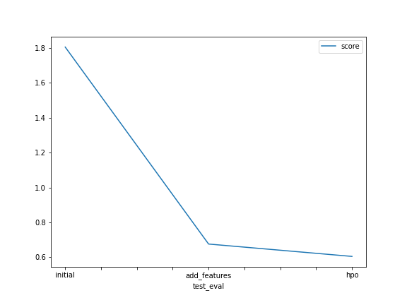

# Report: Predict Bike Sharing Demand with AutoGluon Solution
#### Katharina Mayr

## Initial Training
### What did you realize when you tried to submit your predictions? What changes were needed to the output of the predictor to submit your results?
In order to submit my predictions, all negative predictions needed to be set to 0. Otherwise, Kaggle would have rejected the results.

### What was the top ranked model that performed?
The top ranked model was WeightedEnsemble_L3 in all three cases when running AutoGluon’s Tabular Prediction. It performed best with the default hyperparameter values as well as the tuned hyperparameter values and with as well as without additional features / feature cleaning. 

## Exploratory data analysis and feature creation
### What did the exploratory analysis find and how did you add additional features?
The histograms showed that the features "season" and "weather" were incorrectly seen as integers (i.e. their histogram was displayed which is only done for integer features). Therefore they need to be cast as categories.
I added a feature which contains the hour of the day that was created from the "datetime" feature.
### How much better did your model preform after adding additional features and why do you think that is?
After added additional features the model score changed from 1.80790 to 0.68603. This is also due to correctly casting the features "weather" and "season" as categories. The additional features helped the model to understand and model the underlying data better. 

## Hyper parameter tuning
### How much better did your model preform after trying different hyper parameters?
After added additional features the model score changed from 0.68603 to 0.60451. 

### If you were given more time with this dataset, where do you think you would spend more time?
I would spend more time on feature engineering and creating additional features to enrich the data and help the model understand it better. 
For example it could be interesting to create a feature that has buckets for the temperature values (e.g. < 10, 10 - 19, 20 - 29, >30).
Also I would invest more time in the hyperparameter tuning, also changing the hyperparameters for NN models and setting the time limit higher than 1000 seconds.

### Create a table with the models you ran, the hyperparameters modified, and the kaggle score.
	model	      time	num_bag_folds	num_stack_levels	num_boost_round	num_leaves	                score
0	initial	      600	8	            3	                50	            [lower=26, upper=46]	    1.80790
1	add_features  600	8	            3	                default	        default	                    0.68603
2	hpo	          1000	5	            2	                default	        default	                    0.60451

### Create a line plot showing the top model score for the three (or more) training runs during the project.

TODO: Replace the image below with your own.

### Create a line plot showing the top kaggle score for the three (or more) prediction submissions during the project.

TODO: Replace the image below with your own.

## Summary
The best performing model was the WeightedEnsemble_L3 with 5 folds used for bagging and 2 stacking levels to use in the stack ensemble. The model was given 1000 seconds to train. These hyperparameter changes resulted in a score of 0.60451. Decreasing the num_bag_folds hyperparameter reduced overfitting, thereby resulting in an improved score for the test dataset. Increating training time helped the model learn the data structure better.
I also tuned some GB specific hyperparameters, namely num_leaves and num_boost_round. As a follow-up, it would be interesting to see the performance increase for NN based models if specific hyperparameter for these model types were tuned.
